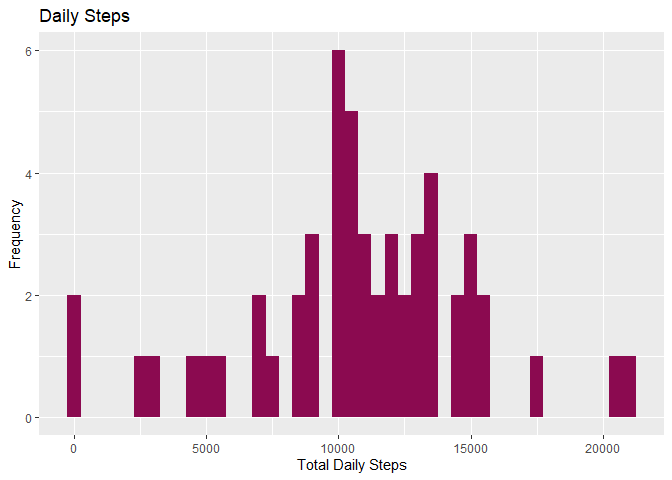
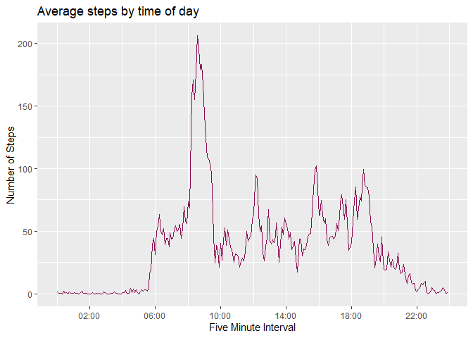
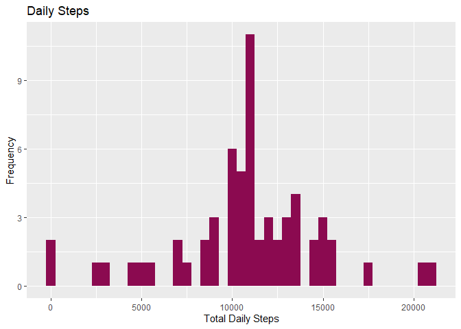
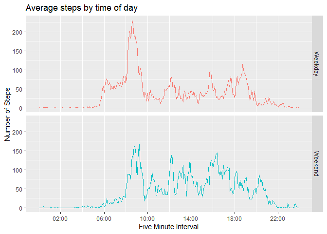

## Introduction

It is now possible to collect a large amount of data about personal movement using activity monitoring devices such as a Fitbit, Nike Fuelband, or Jawbone Up. These type of devices are part of the “quantified self” movement – a group of enthusiasts who take measurements about themselves regularly to improve their health, to find patterns in their behavior, or because they are tech geeks. But these data remain under-utilized both because the raw data are hard to obtain and there is a lack of statistical methods and software for processing and interpreting the data.

This assignment makes use of data from a personal activity monitoring device. This device collects data at 5 minute intervals through out the day. The data consists of two months of data from an anonymous individual collected during the months of October and November, 2012 and include the number of steps taken in 5 minute intervals each day.

The data for this assignment can be downloaded from the course web site:

* Dataset: [Activity monitoring data](https://d396qusza40orc.cloudfront.net/repdata%2Fdata%2Factivity.zip) [52K]

The variables included in this dataset are:

* steps: Number of steps taking in a 5-minute interval (missing values are coded as NA)
* date: The date on which the measurement was taken in YYYY-MM-DD format
* interval: Identifier for the 5-minute interval in which measurement was taken

The dataset is stored in a comma-separated-value (CSV) file and there are a total of 17,568 observations in this dataset.

## Load the required packages


```r
library(dplyr)
library(ggplot2)
library(scales)
```


## Load and preprocess the data


```r
# Read data
steps <- read.csv("./data/activity.csv", header = TRUE)

# Convert date to Date
steps$date <- as.Date(steps$date)

# Convert interval to HH:MM format by padding with leading zeros
steps$interval <- 
  format(strptime(formatC(steps$interval, width = 4, format = "d", flag = "0"), format="%H%M"), format = "%H:%M")
```


## What is the mean total number of steps taken per day?


```r
## Calculate total steps per day

dailySteps <- steps %>%  
          group_by(date) %>%
          summarise(total = sum(steps))


# Plot histogram of mean steps per day

ggplot(dailySteps, aes(total)) + 
  geom_histogram(binwidth = 500, fill = "deeppink4") +
  labs(x = "Total Daily Steps", 
       y = "Frequency", 
       title = "Daily Steps")
```

<!-- -->


###  Mean and median of the total steps taken per day


```r
## Mean number of steps per day

mean(dailySteps$total, na.rm = TRUE)
```

```
## [1] 10766.19
```

```r
## Median number of steps per day

median(dailySteps$total, na.rm = TRUE)
```

```
## [1] 10765
```


## What is the average daily activity pattern?

First, get the mean number of steps taken for each five minute interval, averaged across days


```r
intSteps <- steps %>% 
  group_by(interval) %>%
  summarise(mean = mean(steps, na.rm = TRUE))
```

Make a time series plot showing the average daily activity pattern


```r
ggplot(intSteps, aes(as.POSIXct(interval, format = "%H:%M"), mean)) + 
  geom_line(col = "deeppink4") +
  scale_x_datetime(labels = date_format("%H:%M"), 
                   date_breaks = "4 hours") +
  labs(x = "Five Minute Interval", 
       y = "Number of Steps", 
       title = "Average steps by time of day")
```

<!-- -->


## Which 5-minute interval, on average across all the days in the dataset, contains the maximum number of steps?


```r
# Maximum number of average steps
max(intSteps$mean)
```

```
## [1] 206.1698
```

```r
# Which occurs in this time interval:
intSteps[which.max(intSteps$mean), ]
```

```
## # A tibble: 1 x 2
##   interval  mean
##   <chr>    <dbl>
## 1 08:35     206.
```
  

**08:35 in the morning!** This burst of early morning activity can be observed in the above plot too. Perhaps the subject has a healthy walking commute to work.


## Imputing missing values

Note that there are a number of days/intervals where there are missing values (coded as NA). The presence of missing days may introduce bias into some calculations or summaries of the data.

### Total number of missing values in the dataset 


```r
# Number of observations with NA values 
sum(!complete.cases(steps))
```

```
## [1] 2304
```

Create a new dataset:


```r
# Create a new dataset that is equal to the original dataset but with the missing data filled in.

imputeSteps <- steps %>%
    group_by(interval) %>%
    mutate(steps = ifelse(is.na(steps), mean(steps, na.rm = TRUE), steps))
```


### Make a new histogram of the total number of steps taken each day


```r
# Make a histogram of the total number of steps taken each day (with missing values subbed in)

imputedDailySteps <- imputeSteps %>% 
  group_by(date) %>%
  summarise(total = sum(steps))

ggplot(imputedDailySteps, aes(total)) + 
  geom_histogram(binwidth = 500, 
                 fill = "deeppink4") +
  labs(x = "Total Daily Steps", 
       y = "Frequency", 
       title = "Daily Steps")
```

<!-- -->

It's very similar to the original plot


```r
## Mean number of steps per day

mean(imputedDailySteps$total, na.rm = TRUE)
```

```
## [1] 10766.19
```

```r
## Median number of steps per day

median(imputedDailySteps$total, na.rm = TRUE)
```

```
## [1] 10766.19
```


## Are there differences in activity patterns between weekdays and weekends?

We need to create a new factor variable in the dataset with two levels – “weekday” and “weekend” indicating whether a given date is a weekday or weekend day. We can use the `weekdays()` function for this (which takes a date and returns the day) and compare the output to decide which value to label it.


```r
# Create weekdays/weekend variable

wSteps <- imputeSteps %>%
  mutate(wkday = ifelse(weekdays(date) %in% c("Saturday", "Sunday"), "Weekend", "Weekday" ))

# Turn this into Factor

wSteps <- wSteps %>%
  mutate( wkday = as.factor(wkday) )
```


```r
# Group by interval and wkday (factor) and again calculate mean number of steps

wIntSteps <- wSteps %>% 
  group_by(interval,wkday) %>%
  summarise(mean = mean(steps, na.rm = TRUE))
```


```r
# Create time series plot with faceting on the new wkday factor

ggplot(wIntSteps, aes(as.POSIXct(interval, format = "%H:%M"), mean, col = wkday)) + 
  geom_line(show.legend = F) +
  facet_grid(rows = wIntSteps$wkday) +
  scale_x_datetime(labels = date_format("%H:%M"), 
                   date_breaks = "4 hours") +
  labs(x = "Five Minute Interval", 
       y = "Number of Steps", 
       title = "Average steps by time of day")
```

<!-- -->

